# Credit_Risk_Analysis
----------------------------------------------------------------------------------
### Overview of the analysis:
I have been working with a data scientist for the past week and we have been building and assessing a few different types of machine learning algorithms. We are looking to determine which would work better for credit application assessment purposes. Because the credit loan data is heavily imbalanced towards 'low risk' we will be using **imbalanced-learn** and **scikit-learn** libraries. We are assessing six(6) algorithms within this analysis, we will be assessing the Balanced accuracy score, the precision score and the recall score. Assessing these 3 scores together will give us an indication as to which has the best learning potential and which might or might be the correct model to determine credit worthiness.

### Results: 
------------------------------------------------------------------------------------
**Oversampling Algorithms**
  * **RandomOverSampler() AKA Naive Random Oversampling**
    * Balanced Accuracy Score: **64.4%**
    * Precision: **99%**
    * Recall: **67%**
 
 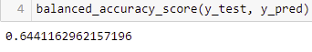
 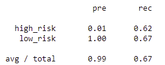
 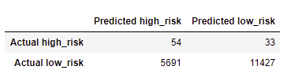
 
 * **SMOTE()- Synthetic minority oversampling technique**
    * Balanced Accuracy Score: **64.8%**
    * Precision: **99%**
    * Recall: **64%**

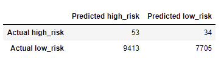

**Undersampling Algorithm**
  * **ClusterCentroids Resampler()**
    * Balanced Accuracy Score: **51.0%%**
    * Precision: **99%**
    * Recall: **44%**

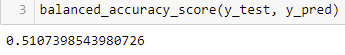
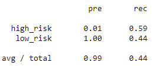

**Combination (Over and Under) Sampling**
  * **SMOTEENN()**
    * Balanced Accuracy Score: **63.6%**
    * Precision: **99%**
    * Recall: **58%**

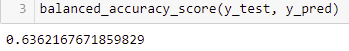
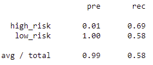
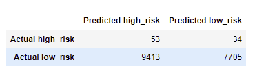

**Ensemble Learning Algorithms:**
  * **BalancedRandomForestClassifier**
    * Balanced Accuracy Score: **78.7%**
    * Precision: **99%**
    * Recall: **91%**

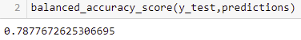
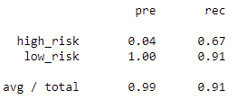 
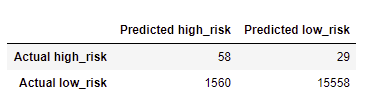 
  
  * **EasyEnsembleClassifier**
    * Balanced Accuracy Score: **94.3%**
    * Precision: **99%**
    * Recall: **94%**

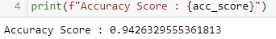
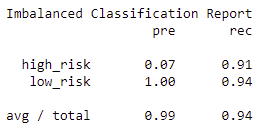
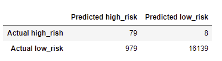
### Summary: 
---------------------------------------------------------------------------------
The algorithms that we used to analyze our data all show weak precision when determining if an applicant is high risk. The Ensemble learning methods demonstrate a lot of improvement from the previously tested methods especially when it comes to recall of properly determining the high-risk applicants. But even the method with the best accuracy score and best recall score,  the Easy Ensemble model, still predicts almost 1000 applicants as high risk when they are actually low risk. Any banking institution would miss out on thousands of dollars in fees if they were to use any of these algorithms to determine eligibility. I would not recommend any of these algorithms.
