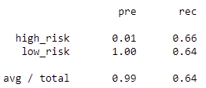

# Credit_Risk_Analysis

#### Overview of the analysis:
I have been wrking awith a data scientist for the past week and we have been building and assessing a fewd ifferent types of machine learnign algorithms. We are looking to determine which would work better for credit application assessment purposes. Due to the the fact that the credit loan data is heavily imbalnced towards 'low risk' we will be using **imblanced-learn** and **scikit-learn** libraries. We are assessing six(6) algorithms within this analysis, we will be assessing the Balanced accuracvy score, the precision score and the recall score. Assessing these 3 scores together will give us a indication as to which has the best learning potential.

#### Results: 

**Oversampling Algorithms**
  * RandomOverSampler() AKA Naive Random Oversampling
    * Balanced Accuracy Score: **64.4%**
    * Precision: **99%**
    * Recall: **64%**
  
 * SMOTE()- Synthetic minority oversampling techniqu
    * Balanced Accuracy Score: **64.8%**
    * Precision: **99%**
    * Recall: **64%**

**Undersampling Algorithm**
  * ClusterCentroids Resampler()
    * Balanced Accuracy Score: **52.9%%**
    * Precision: **99%**
    * Recall: **45%**

**Combination (Over and Under) Sampling**
  * SMOTEENN()
    * Balanced Accuracy Score: **63.6%**
    * Precision: **99%**
    * Recall: **58%**

**Ensemble Learning Algorithms:**
  * BalancedRandomForestClassifier
    * Balanced Accuracy Score: **78.7%**
    * Precision: **99%**
    * Recall: **91%**
  
  * EasyEnsembleClassifier
    * Balanced Accuracy Score: **94.3%**
    * Precision: **99%**
    * Recall: **94%**

#### Summary: 
**There are a few things to note with our results:**
  1. The Precision score also known as the positive predictive value is 99% for each algorithm. This is due to the imbalance of the dataset. For assessment purposes we wil not be taking it into consideration when determining the usefulness of a model for this analysis.
  2. Balanced Accuarcy Score(BAS):
     * For the Over, Under and Combination Sampling algorithms, the Balanced Accuracy score is relatively low. The scores range from the 50's to the mid 60's. 
     * The over sampling methods, Random OverSample and SMOTE have almost identical balanced accuracy scores at 64%. The ClusterCentroid (under sampling) technique on the other hand is markedly lower, almost 50%.
     * The SMOTEENN (under and over sampling) technique, while only slightly lower than the over sampling technique is greater than the ClusterSCentroids technique and thus can be given a little more credence if we were looking to use a oversampling technique.
     * The Ensemble learning algorithm, BalanceRandomForestClassifier accuarcy score is almost 15 points higher than the best performing over sampling technique at 78%. It's starting to like the ensemble learning might have an edge.
     * EasyEnsembleClassifier, the last Ensemble learning algorithm that was tested during our analysis had an accuracy score of 94.3%. Of the tested algorithms based on accuracy score, we have a clear winner.
  3. Recall/Sensitivity Score: tests how likely the test is to determine a True positive:
     * 

Recommendation:
Summarize the results of the machine learning models, and include a recommendation on the model to use, if any. If you do not recommend any of the models, justify your reasoning.
